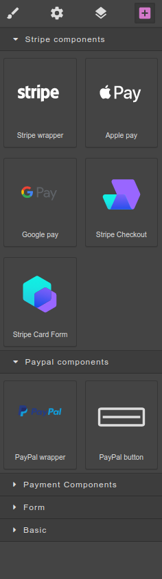

= Payment Page
:toc:

:p2-url: https://github.com/P2SaaS/p2-api-doc

Payment Page (or shortly P2 or p2) is a piece of functionality that allows to integrate with your web-application different payment methods that a client can use to pay money for a target service or product.

The Builder editor allows to create a layout of P2 by using some predefined components. Builder allows to generate both front-end and back-end code to make the designed P2 operational.

Using the builder web-application is possible to create and design many Payment pages with different payment methods, connected Payment Service Providers (PSP), etc. to integrate them in various applications or scenarios of the same target application. E.g. it might be different layout and payment methods for Subscription and for payment by Credit Card, the P2 might be tuned for specific country or user groups, and so on.

== Introduction

P2 functionality provided by two parts: front-end application and back-end application. Front-end (FE or P2 FE) consists of plain html-page accompanied by css-file with specific page styles and js-file contains JavaScript code integrated with the html-layout. So, the front-end side of P2 is a static html-page integrated with reactive code.

Page design, styles and themes, chosen components and their configuration settings to specific PSPs defined by customer in Builder editor using visual toolset like Component Palette, Attribute Editors, etc. in each specific P2 project.

P2 BE part consists of the REST API endpoints that P2 FE interacts with to provide integrations with chosen Payment Service Providers (PSP) or providers.

Target application should use configuration capabilities to integrate with P2 functionality and not requires developing code to make P2 workable, although it's possible to tune some aspects of its business-logic, e.g. adding specific behavior for web-hooks that PSP calls to provide a transaction resulting status.

List of PSPs and examples of P2 includes:

|===
|Provider |Supports |P2 Reference

|https://stripe.com/[Stripe]
|Apple Pay, Google Pay, Payment links, Credit Card checkout, Default Amount, Custom Amount, layout components
|https://f5cb8569-40d7-415f-82ba-9ae207ffd804.paymebuilder.com/?signature=lCC4%2FhOExMqDqrv0RmxEhMqvZjiH7mGIjlqz%2Bcd13OKiY%2FcoYZHGTV4zos8jDbLQR0gyGe%2BX7%2BdXvg3SRsvDQUSVC7LPJdSA08v64Cjj4FlMRtlhJ6GP7SMkPlxnuvAVONQaNsTZxET1JfTQ6A52LSdKSsYIWQFzaG8qPwYGPSBKH9z7zv4moOHd9g%2F4DDfC&amount=1000&currency=EUR[Single Credit Card component]

https://04bd86fa-2fbc-4d4a-ae39-b225aba9187c.paymebuilder.com/?signature=lCC4%2FhOExMqDqrv0RmxEhMqvZjiH7mGIjlqz%2Bcd13OKiY%2FcoYZHGTV4zos8jDbLQY18WU4puD1%2FWL9WH4U6Lty%2By594XybbiETkgSymi4mrbW%2FB68sUhN1jkixKCxi3XE2LN3%2BIlnbBt6g5eLRRHBj94VuVuoomolcX5JdadMEJ0cf31braIY6JOD9nex5V3&amount=1000&currency=EUR[Credit Card component with Amount]

https://388cfaee-8bcd-42b2-b66a-ef4ee9261c78.paymebuilder.com/?signature=lCC4%2FhOExMqDqrv0RmxEhMqvZjiH7mGIjlqz%2Bcd13OKiY%2FcoYZHGTV4zos8jDbLQ%2Fbzg7%2FQ6bsiblo%2B9r5AqUePXtGx6YVW6uNod6RoVLhesxhsgPlHJKRFINdLsP9jlYgDn%2BVXMZljD14LkmKvbVvsh71AwWmDTZT1yTlwu0HDAZbnv9mehDsBWTmd%2FEt3W&amount=1000&currency=EUR[Stripe Payments Link with Amount]

https://73d2075b-0564-467c-9b1e-614d29769b31.paymebuilder.com/?signature=lCC4%2FhOExMqDqrv0RmxEhMqvZjiH7mGIjlqz%2Bcd13OKiY%2FcoYZHGTV4zos8jDbLQ0KAVKK1yWwaHADmhFnL42Ud%2FUmnb0gagRD%2BbVPB8rLyzptSUdgg8fKhA0ENrcHi97BunpU%2FoqnWjos1WQ%2BbxiXsSTNExXnFRBIX9noKPypBf0Ge3NKQLtcNq2nwl71N5&amount=1000&currency=EUR[Wallets]

|https://www.paypal.com/[PayPal]
|PayPal Button, Klarna, Giropay, SEPA, Default Amount, Custom Amount, layout components
|https://762ed29d-0d1d-4c3f-b5a8-e8a367d5f7a5.paymebuilder.com/?signature=lCC4%2FhOExMqDqrv0RmxEhMqvZjiH7mGIjlqz%2Bcd13OKiY%2FcoYZHGTV4zos8jDbLQwVP3SMo6DkAlkDCo2RJVSeEQ4UUNbut5NUnyv9dk9wZng70zL1%2FWfX3L56ZQ%2F54oZAL3v9QGmanpmR0aodKbxunvFAIJV8QpsV1YbF%2BkEiW69zNMOvqN5zTtT9hRM%2F2f&amount=1000&currency=EUR[PayPal Button]

|===

== Components

Components available for visual design inside Builder canvas. They separated to several groups inside Components Palette. Groups might be PSP-specific:

* Stripe Components
* PayPal Components

and general (not PSP-specific):

* Payment Components
* Form
* Basic

== Front-end & Back-end integration

P2 FE code calls respective PSP API and P2 BE API. The standard flow is (as an example of Stripe Credit Card checkout):

1. Call Stripe endpoint to get one-time unique token;
2. Call P2 BE endpoint providing the one-time token;
3. P2 BE communicates under the hood with Stripe PSP payment service to fulfill the transaction;
4. P2 BE endpoint returns a response to P2 FE with results of the transaction fulfilment;
5. P2 FE based on the BE response forwarded either to successful URL (Confirmation page) or to error URL.

When a user initiates an action (like payment, e.g.) the P2 front-end populates a request both with respective parameters to P2 back-end, which implements specific business-logic to fulfill respective payment transaction.

=== Authentication

In some scenarios, described in <<_target_application_p2_integration>>, P2 required to be integrated in a security context of the target application to call P2 back-end with respective authentication information (like user Id, P2 Id, etc.)

To populate authentication information in a secure manner, encrypted parameters used (as described in details below).

== Target application & P2 integration

Target application intended to seamlessly navigate to P2 and allows an end-user to be able to pay for a service or product. To make the payment possible different scenarios might be employed.

*Scenario 1*

User can freely choose predefined amount of money to pay or set up custom amount. Using this scenario, target application just navigates to P2 and after that end-user would pay some amount. Such scenario is applicable for paying donation, tips, etc.

To confirm the payment transaction successfully completed and possible to persist the transaction in local repository, P2 BE expose several REST endpoints which being bundled with the target application can be executed as web-hooks by a respective PSP.

*Scenario 2*

In this scenario the payer should pay exact predefined amount of money using different payment methods provided by P2.
Payer in this scenario cannot choose or change the amount or currency of the transaction. It's applicable to pay for some services or products that require that exact price being paid.

Then, when navigate to P2 the target application must populate (encrypted) parameters that include amount, currency, authentication information, etc. For rendering purposes the same information should be provided in unencrypted form, but P2 BE decide on encrypted parameters and would reject the transaction in case they are misleading.

The same way, web-hook endpoints exposed by P2 BE should be used to persisting or checking the transaction result.

To implement respective functionality in a flexible way, the target application have to instantiate a bean implementing `WebhooksPaymentListener` interface. The implementation might simply log the incoming events or delegate it to auditing, or persist, etc. depending on required business-logic.

=== P2 Parameters
Format of parameters that target application should pass to the P2 is depicted below:

|===
||Optional |Optional |Optional |Mandatory |Mandatory

|Encrypted
|User auth
|P2 Id
|Price Id
|Amount
|Currency

|Unencrypted
|
|
|Unit
|Amount
|Currency

|===

Encrypted parameters provided in base64-encoded string format. All parameters pass to P2 as url-encoded parameters. After the P2 use unencrypted parameters to render the page layout, when user click some action's button to initiate payment, all these parameters propagates to P2 back-end. P2 back-end decrypt the encrypted values of the parameters and use them to make a respective transaction.

To create encrypted parameters, the target application should

=== Web-hooks

After the transaction confirmed on PSP side, it sends a confirmation to web-hook endpoints that should be registered upfront for each specific PSP and each specific P2. The web-hooks implemented in a form of REST controller, which endpoints can be registered in PSP as web-hook endpoints. Inside the web-hook controller, each endpoint delegates the specific implementation to the listener-components, that depending on the bound <<_p2_be_modules>> and might have different implementation. The most common implementation of the web-hooks is to persist transaction in a local application DB for future reference.

== Payment Page (P2) API

{p2-url}/blob/main/resources/api/P2%20API-dev-swagger-apigateway.yaml[P2 API]

http://54.81.252.5:8080/swagger-ui/index.html[Swagger UI]

== P2 BE Modules

Current implementation of P2 back-end made in Java 11 using Spring-boot framework and Maven package manager. It contains 2 custom modules that might be included into the target application to be bound and running in the same application context (e.g. under the same web-application server):

1. Common P2
2. Auditing
3. P2 back-end

Common P2 contains base classes for specific PSP (Stripe, PayPal, etc.) and basic implementation of the web-hook endpoints. To include the module into a target application project:

[source,maven]
----
<dependency>
<groupId>com.p2s2</groupId>
<artifactId>p2-common</artifactId>
<version>1.0.0-RELEASE</version>
</dependency>
----

Auditing module being included in the target application allows to make auditing trail for important user actions. To include the module into a target application project:

[source,maven]
----
<dependency>
<groupId>com.p2s2</groupId>
<artifactId>auditing</artifactId>
<version>1.0.0-RELEASE</version>
</dependency>
----

P2 back-end module provides functionality for all back-end Spring-boot code, that works with front-end code of a designed Payment Page. To include the module into a target application project:

[source,maven]
----
<dependency>
<groupId>com.p2s2</groupId>
<artifactId>api</artifactId>
<version>1.0.0-RELEASE</version>
</dependency>
----
